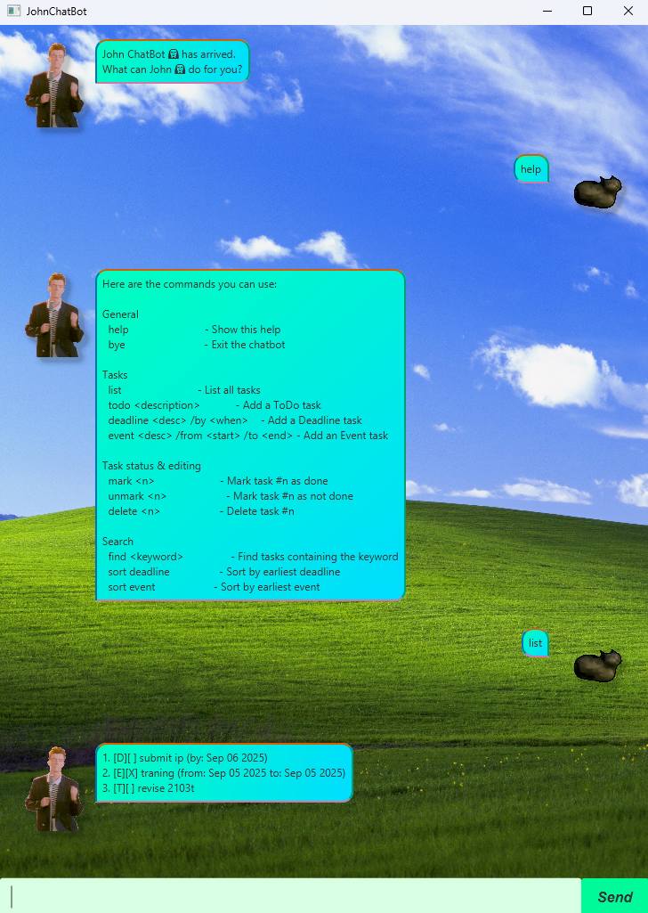

# John ChatBot User Guide



John is a personal task management chatbot that helps you keep track of your todos, deadlines, and events. With John, you can easily add, mark, delete, and find your tasks through simple text commands.

## Features

### Adding Todos

Add a simple todo task without any date/time constraints.

Format: `todo <description>`

Example: `todo read book`

Expected output:
```
Got it. I've added this task:
  [T][ ] read book
Now you have 1 tasks in the list.
```

### Adding Deadlines

Add a task with a specific deadline.

Format: `deadline <description> /by <DD/MM/YYYY HHMM>`

Example: `deadline return book /by 28/8/2025 1800`

Expected output:
```
Got it. I've added this task:
  [D][ ] return book (by: Aug 28 2025, 6:00 PM)
Now you have 2 tasks in the list.
```

### Adding Events

Add an event with start and end times.

Format: `event <description> /from <DD/MM/YYYY HHMM> /to <DD/MM/YYYY HHMM>`

Example: `event meeting /from 28/8/2025 1800 /to 28/8/2025 2000`

Expected output:
```
Got it. I've added this task:
  [E][ ] meeting (from: Aug 28 2025, 6:00 PM to: Aug 28 2025, 8:00 PM)
Now you have 3 tasks in the list.
```

### Listing Tasks

View all your current tasks.

Format: `list`

Expected output:
```
Here are the tasks in your list:
1. [T][ ] read book
2. [D][ ] return book (by: Aug 28 2025, 6:00 PM)
3. [E][ ] meeting (from: Aug 28 2025, 6:00 PM to: Aug 28 2025, 8:00 PM)
```

### Marking Tasks as Done

Mark a task as completed.

Format: `mark <task_number>`

Example: `mark 1`

Expected output:
```
Nice! I've marked this task as done:
  [T][X] read book
```

### Unmarking Tasks

Mark a completed task as not done.

Format: `unmark <task_number>`

Example: `unmark 1`

Expected output:
```
OK, I've marked this task as not done yet:
  [T][ ] read book
```

### Deleting Tasks

Remove a task from your list.

Format: `delete <task_number>`

Example: `delete 1`

Expected output:
```
Noted. I've removed this task:
  [T][ ] read book
Now you have 2 tasks in the list.
```

### Finding Tasks

Search for tasks containing a specific keyword.

Format: `find <keyword>`

Example: `find book`

Expected output:
```
Here are the matching tasks in your list:
1. [D][ ] return book (by: Aug 28 2025, 6:00 PM)
```

### Sorting Tasks

Sort tasks by type (deadline or event) based on their dates.

Format: `sort <deadline|event>`

Example: `sort deadline`

Expected output:
```
Tasks sorted by deadline dates.
```

### Getting Help

Display available commands.

Format: `help`

### Exiting the Application

Close the chatbot.

Format: `bye`

## Task Format Legend

- `[T]` - Todo
- `[D]` - Deadline  
- `[E]` - Event
- `[X]` - Completed task
- `[ ]` - Incomplete task

## Date Format

All dates and times should be entered in the format: `DD/MM/YYYY HHMM`

Examples:
- `28/8/2025 1800` (28th August 2025, 6:00 PM)
- `1/12/2025 0900` (1st December 2025, 9:00 AM)

## Getting Started

1. Download the latest release of John ChatBot
2. Run the application using `java -jar ip.jar`
3. Start managing your tasks with the commands above!

Your tasks are automatically saved to `data/johnChatBot.txt` and will be loaded when you restart the application.

## External Resources and AI Usage

Attributions:
1. build/images/john_dancing.gif - https://tenor.com/view/rick-astley-dance-never-gonna-give-you-up-rickroll-wtg-gif-19135815
2. build/images/you_dancing.gif - https://tenor.com/view/cat-oiiaoiia-cat-cat-spinning-gif-7952242942163821023
3. build/images/chat_background.jpg - https://www.reddit.com/r/pcmasterrace/comments/23qpse/in_honor_of_windows_xp_i_made_a_4k_version_of/

AI Usage: Refer to the file AI.md in the root of this repo.